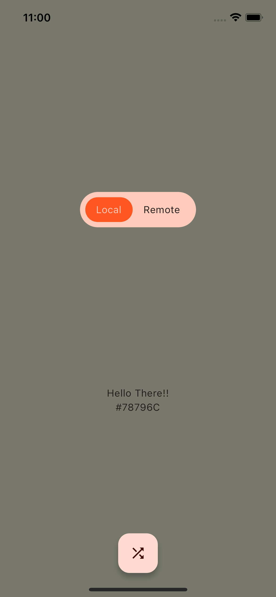

# Random Color Generator App

This Flutter app is a simple mobile application that generates a random color and sets it as the background color of the screen. It's a fun and interactive way to explore different color combinations and create visually appealing backgrounds.

## Features

- **Random Color Generation**: With a single tap of a button, the app generates a completely random color.

- **Background Color Update**: The generated color is set as the background color of the screen, providing an immediate visual representation of the chosen color.

- **Hexadecimal Color Code**: The hexadecimal color code of the generated color is displayed on the screen, making it easy for users to replicate the color elsewhere.

## Screenshots

## Getting Started

### Prerequisites

- [Flutter](https://flutter.dev/docs/get-started/install)

### Installation

1. Clone this repository to your local machine using:

git clone https://github.com/fasilajibriel/solid_software_flutter_task

2. Navigate to the project directory:

cd solid_software_flutter_task

3. Install the required dependencies:

flutter pub get

### Usage

1. Connect your mobile device or start an emulator.

2. Run the app:

flutter run

3. Once the app is running, tap the shuffle button or anywhere on the background to generate a random color and set it as the background.

4. The hexadecimal color code of the generated color will be displayed on the screen.

5. Experiment with different color combinations by tapping the button multiple times.

## Contributing

If you'd like to contribute to this project, please follow these guidelines:

1. Fork the repository.

2. Create a new branch for your feature or bug fix: 

git checkout -b feature/your-feature-name

3. Make your changes and commit them with descriptive commit messages.

4. Push your changes to your fork:

git push origin feature/your-feature-name

5. Create a Pull Request against the `main` branch of this repository.

## License

This project is licensed under the MIT License - see the [LICENSE](LICENSE) file for details.

## Acknowledgments

- Special thanks to the Flutter community for their support and contributions.

Enjoy exploring random colors with the Random Color Generator App! If you encounter any issues or have suggestions for improvement, feel free to [open an issue](https://github.com/fasilajibriel/solid_software_flutter_task/issues).
